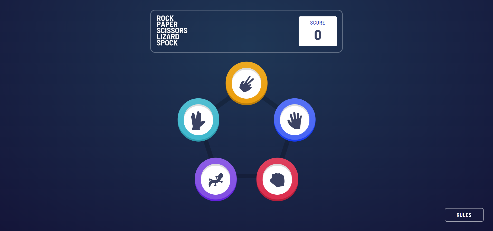

# Rock-Paper-Scissors-Lizard-Spock Game
This is the solution to the [Rock, Paper, Scissors](https://www.frontendmentor.io/challenges/rock-paper-scissors-game-pTgwgvgH) challenge from frontendmentor.io with bonus version of game (Rock, Paper, Scissors, Lizard, Spock) inspired by The Big Bang Theory ([checkout this clip](https://www.youtube.com/watch?v=iSHPVCBsnLw&ab_channel=WarnerBros.TV))

## Overview
### The challenge
User should be able to:
- View the optimal layout for the game depending on their device's screen size
- Maintain the state of the score after refreshing the browser 
- Play Rock, Paper, Scissors, Lizard, Spock against the computer

### Screenshots

### Live 
Check out [live](https://rock-paper-scissors-35dfd.web.app/)

### Tech stack
- [React](https://reactjs.org/) - JS library
- [Styled Components](https://styled-components.com/) - For styles
- Redux (redux-toolkit)
- Flexbox
- CSS Grid
- Mobile-first workflow

## Author
- LinkedIn: [Miłosz Rutkowski](www.linkedin.com/in/miłosz-rutkowski-38a52b225)
- e-mail: m.rutkowski0909@gmail.com

## Building app

### `npm start`

Runs the app in the development mode.\
Open [http://localhost:3000](http://localhost:3000) to view it in the browser.

The page will reload if you make edits.\
You will also see any lint errors in the console.

### `npm test`

Launches the test runner in the interactive watch mode.\
See the section about [running tests](https://facebook.github.io/create-react-app/docs/running-tests) for more information.

### `npm run build`

Builds the app for production to the `build` folder.\
It correctly bundles React in production mode and optimizes the build for the best performance.

The build is minified and the filenames include the hashes.\
Your app is ready to be deployed!

See the section about [deployment](https://facebook.github.io/create-react-app/docs/deployment) for more information
